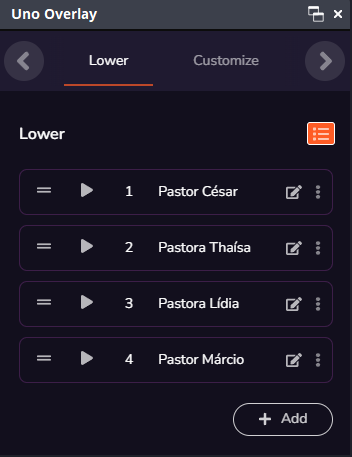
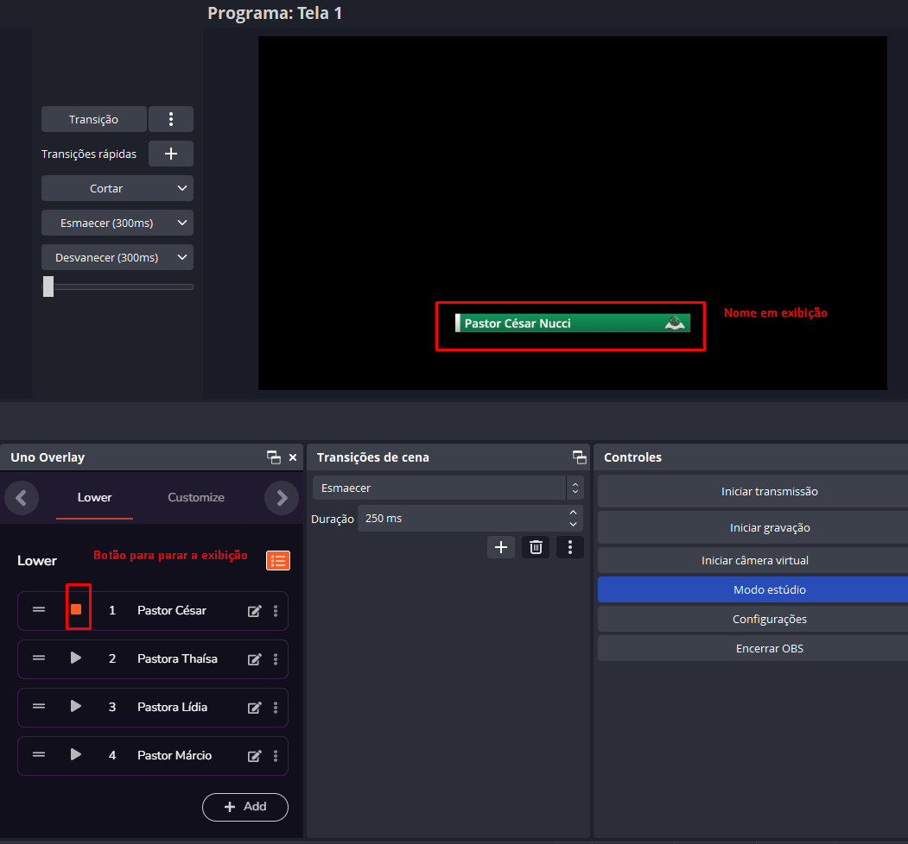
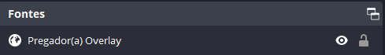

# Dicas gerais :id=dicas-gerais

## Projeção x Transmissão :id=projecao-transmissao

?>Projeção é tudo o que fazemos internamente, por exemplo:
Ao iniciar o OBS projetamos a tela de programa para a igreja.

---

?>Transmissão é tudo o que enviamos para outro lugar, por exemplo:
Ao iniciarmos a transmissão, estamos enviando nosso vídeo em tempo real para o Youtube.

## Projeção Interna - 30 semanas

Para a projeção interna, e nos dias do 30 semanas é necessário alterar a forma de exibição do holyrics. Para fazer isso, você precisa estar na tela inicial do holyrics, e clicar em configurações de exibição:

E desmarcar a opção ocultar tela:

Ao término do 30 semanas, voltar a configuração para ocultar tela e testar antes de desligar o computador.

## OBS - Modo estúdio

?> A utilização do modo estúdio é recomendada na maioria dos casos, pois dessa forma é possível fazer ajustes e testes antes de mandar as informações do OBS para a projeção e para o Youtube.

No modo estúdio é necessário utilizar o botão de transição para alternar entre as cenas de prévia (esquerda) e do programa (direita).

## OBS - Modo padrão

?> A utilização do modo padrão exige maior atenção entre a câmera e o OBS. Não recomendada caso exista a necessidade de ajustar a câmera antes de mandar o conteúdo para a transmissão, pois não há separação entre cenas em espera e a cena que está sendo enviada.

## Organização em Cenas

?> As cenas são utilizadas e separadas por momentos específicos do culto, e cada uma delas contém apenas o que é necessário para ser exibido.

---

# 1. Configuração Inicial

?> Os passos 1.1 até o 1.3 são feitos antes de ligar o computador.

## 1.4. Como verificar conexão a com a internet

Para verificar a conexão com a internet, cheque o ícone próximo ao relógio:

!> IMPORTANTE: Caso estejamos sem internet e seja um dos cultos que ficam como públicos (quarta e domingo à noite) ao invés de transmitir, utilizar a gravação do OBS. Qualquer outro culto, utilizar apenas projeção.

### 1.4.1. Sem internet

### 1.4.2. Com internet

## 1.5 e 1.6 Abrir Holyrics e abrir OBS

O Holyrics e OBS são abertos ao clicar 2x em seus ícones.

!> IMPORTANTE: Abrir _SEMPRE_ o Holyrics primeiro, pois o OBS depende dele já estar aberto para exibição de músicas, imagens e a Bíblia. Caso o OBS tenha sido aberto primeiro, é necessário [Atualizar o Cache](#atualizar-cache)

---

# 2. Preparar o Holyrics

## 2.1. Pegar versículos

Os Versículos que serão utilizados nos cultos normalmente são enviados em até 1 dia de antecedência, no grupo 'Sermão e Flyers' no whatsapp:

### 2.1.1 Procurar versículos no Holyrics

Na parte de bíblia do holyrics, começar a digitar o nome do livro da Bíblia:

Após encontrar o versículo, adicioná-lo à lista de favoritos:

## 2.2. Pegar louvores para o culto atual

Os louvores que serão ministrados nos cultos normalmente são enviados em até 1 dia de antecedência, no grupo do Ministério de Louvor e da Igreja...

No formato de playlist do youtube:

## 2.3. Deixar louvores com 2 linhas

!> IMPORTANTE: Os louvores precisam estar em 2 linhas ou menos pois caso eles possuam muitas palavras a imagem na transmissão fica ruim. 

### 2.3.1. Editar louvores

Com a música que precisa ser editada aberta, clicar no botão editar:

Separar os versos em grupos de 2 linhas:

Salvar e sair ao terminar:

## 2.4. Verificar se o louvor é exibido

---

# 3. Preparar OBS

## 3.1. Verificar se som está chegando no OBS

!> _NUNCA_ Baixe o volume de entrada no OBS, o volume de saída para a live é ajustado _SOMENTE_ na mesa de som.

## 3.2. Projetar tela do OBS

## 3.3. Atualizar Cache do Holyrics Bíblia

## 3.4. Atualizar Cache do Holyrics Louvor

## 3.5. Atualizar Cache do Holyrics Imagem

## 3.6. Atualizar o vídeo dos avisos

## 3.6.1 Baixar o vídeo no grupo de mídia

## 3.6.2. Atualizar o vídeo no OBS

# 4. Preparar Youtube

## 4.1. Abrir página da transmissão do Youtube

## 4.2. Alterar título

### 4.2.1. Pegar título na Checklist

> O título da checklist é gerado automaticamente nos dias de cultos (Segunda, Quarta, Sábado e Domingo). Caso o culto/evento seja em outro dia, digitar o nome do mesmo diretamente no Youtube.

### 4.2.2. Editar título da transmissão no Youtube

## 4.3. Editar miniatura do vídeo com base no dia da semana

Clicar no botão editar

Escolher miniatura no PC

## 4.4. Visibilidade

> Público - Visível para todos - Apenas cultos de Quarta/Domingo à noite

> Não listado - Visível _APENAS_ para quem possui o link - Todos os outros cultos/eventos

> Privado - Disponível apenas para o dono do canal.

# 5. 5 Minutos para o Início do culto

?> O passo 5.1. é relacionado à Camera

## 5.2. Mudar para cena 'Início' para iniciar a contagem regressiva

<video width="1080" loop autoplay muted>
<source src="v2.0/_media/5-2-cena-inicio.mov" type="video/mp4">
</video>

## 5.3. Iniciar Transmissão no OBS

<video width="1080" loop autoplay muted>
<source src="v2.0/_media/5-3-transmissao-obs.mov" type="video/mp4">
</video>

## 5.4. Verificar se transmissão iniciou

<video width="1080" loop autoplay muted>
<source src="v2.0/_media/5-4-verificar-transmissao-iniciada.mov" type="video/mp4">
</video>

## 5.5. Divulgar link da transmissão

Para pegar o link da transmissão acesse a página da transmissão no youtube:

!>Compartilhar o link no grupo da igreja para cultos _públicos_ (quarta e domingo à noite) e somente para quem estiver autorizado nos outros cultos (grupo de louvor).

Copiar o link na janela seguinte:

---

# 6. Abertura

---

## 6.1. Como exibir o Nome do pregador(a)

O Uno Overlay é um painel utilizado para exibir os nomes dos pregadores(as) nos cultos:

Para utilizá-lo basta apenas clicar no botão play no nome do pregador(a) e deixar rodar por 30 segundos.

Após 30 segundos, clicar no botão Stop.

O nome do pregador aparecerá apenas quando a Fonte estiver visível:

## 6.2. Verificar qualidade da transmissão

Para verificar a qualidade da transmissão, é necessário olhar na página da transmissão do youtube, e nas informações da transmissão no OBS.

!>IMPORTANTE: Caso a transmissão esteja muito ruim ao iniciar o culto, iniciar a gravação em arquivo no PC.Em último caso esse vídeo pode ser enviado para o youtube posteriormente.

# 7. Dízimo

Ajustar a câmera para que as informações da conta bancária não sobreponha o pessoal do louvor no vídeo.

?>Fazer a transição quando o louvor iniciar.

?>Mudar para outra cena ao final da oração.

---

# 8. Durante o culto

## 8.1. Rodar vídeo redes sociais

<video width="1080" loop autoplay muted>
<source src="v2.0/_media/8-1-Redes-sociais.mov" type="video/mp4">
</video>
---

# 9. Encerrar transmissão

## 9.1. Mudar para a cena final

## 9.2. Desvanecer para preto

## 9.3. Interromper Transmissão no OBS

## 9.4. Encerrar Transmissão no Youtube

## 9.6. Remover versículos dos favoritos

<video width="1080" loop autoplay muted>
<source src="v2.0/_media/9-6-limpar-favoritos.mov" type="video/mp4">
</video>
